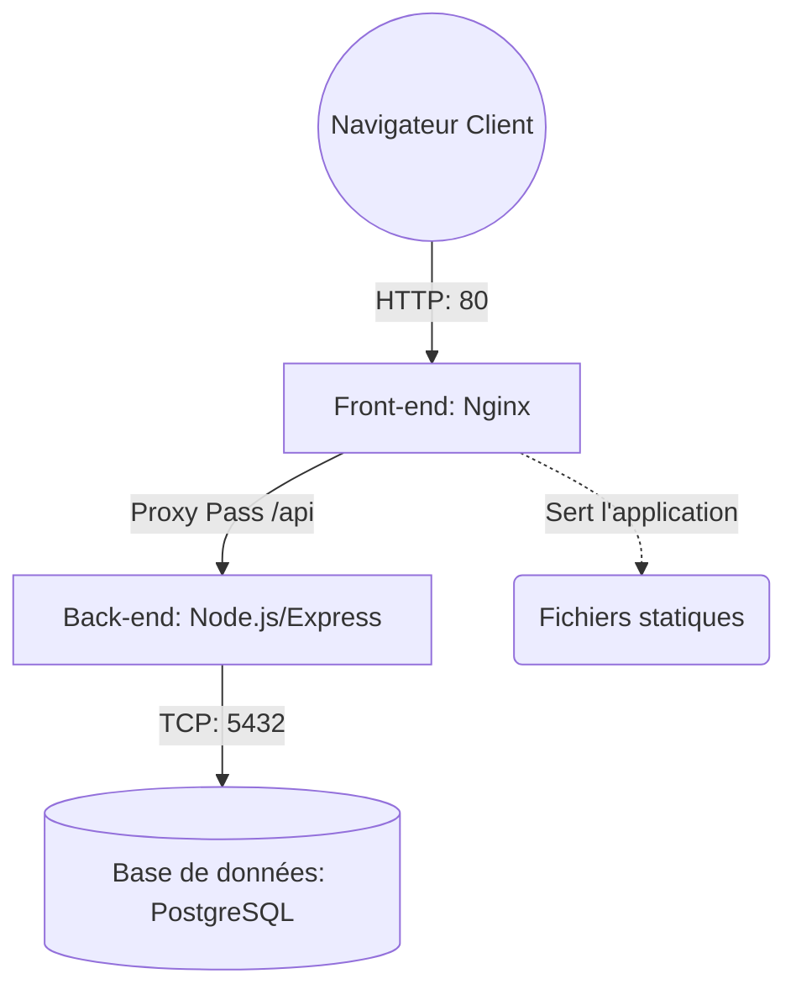

# VitalSync - Application Médicale

## Description et Architecture
VitalSync est une application web médicale moderne découpée en micro-services.
L'architecture repose sur la séparation claire des responsabilités :
- Un **Front-end** (SPA) servi par un serveur web en tant que proxy inverse.
- Un **Back-end** (API RESTFUL) traitant la logique métier et technique.
- Une **Base de données** relationnelle assurant la persistance sécurisée des données de la clinique.



## Prérequis
Pour lancer ce projet localement, les outils suivants doivent être installés sur votre machine (Windows/Mac/Linux) :
- **Docker** (v20.10 minimum)
- **Docker Compose** (v2.0 minimum)
- **Git**

## Installation et lancement (Docker Compose)
1. Clonez le dépôt Git sur votre machine locale :
   ```bash
   git clone <url-du-repo>
   cd vitalsync
   ```
2. Créez votre fichier d'environnement en copiant le modèle et remplissez vos identifiants :
   ```bash
   cp .env.example .env
   ```
3. Lancez la construction et le démarrage des conteneurs :
   ```bash
   docker compose up --build -d
   ```
4. L'application est alors accessible :
   - Front-end : `http://localhost`
   - Back-end / API : `http://localhost:3000`

## Pipeline CI/CD (GitHub Actions)
Afin de garantir une intégration et qualité continues, une pipeline GitHub Actions se déclenche automatiquement à chaque publication sur `develop` et lors des Pull Requests vers `main`. Elle est composée de :
1. **Étape 1 (Lint & Tests)** : Installe les dépendances Node.js, valide la propreté du code via `ESLint`, et exécute la batterie de tests `Jest`. Si une erreur est identifiée, le processus est immédiatement interrrompu.
2. **Étape 2 (Build & Push)** : Construit les différentes images Docker finales en y appliquant le tag du SHA de commit exact. Les images sont ensuite stockées au sein du GitHub Container Registry (GHCR) privé du projet.
3. **Étape 3 (Staging)** : Lance un faux déploiement de type "Recette" complet pour valider l'intégrité de l'infrastructure via un *health check* obligatoire (requête HTTP 200 sur l'endpoint `/health`).

## Choix techniques structurants
- **Images système Alpine Linux (`node:18-alpine`, `nginx:alpine`)** : Divise par 10 le poids des conteneurs tout en diminuant la surface d'attaque sécuritaire grâce à une empreinte OS extrêmement restreinte par rapport à base de type Ubuntu/Debian.
- **Docker Multi-Stage Build** : Permet d'isoler la "construction avec outils de tests" du "résultat final", garantissant que la production finale n'embarque aucun code inutile ni paquet lourd tel qu'un framework de tests.
- **Réseau privé dédié (Bridge)** : Isoler les 3 conteneurs dans leur propre réseau afin d'exploiter la résolution de noms de domaine internes (DNS) Docker sans jamais exposer intentionnellement la base de données vers l'internet public pour protéger les données patient.
- **Nginx Reverse Proxy** : Héberge du contenu hyper-rapidement et intercepte le trafic front de l'API pour éliminer nativement toute complication liée à la fameuse faille / sécurité in-browser "CORS".
